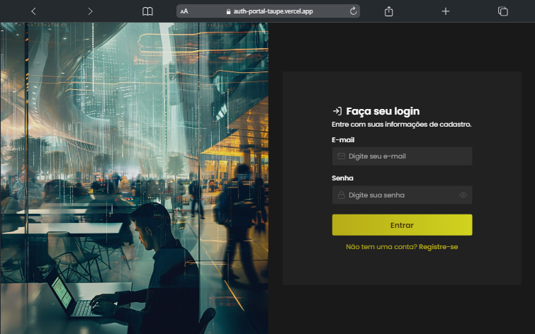
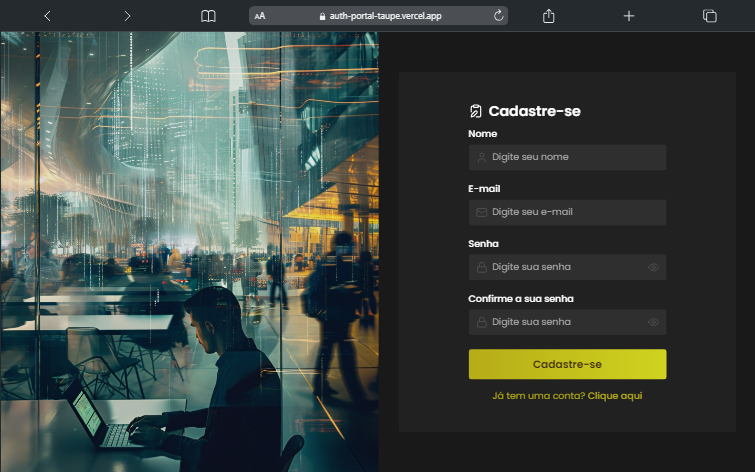
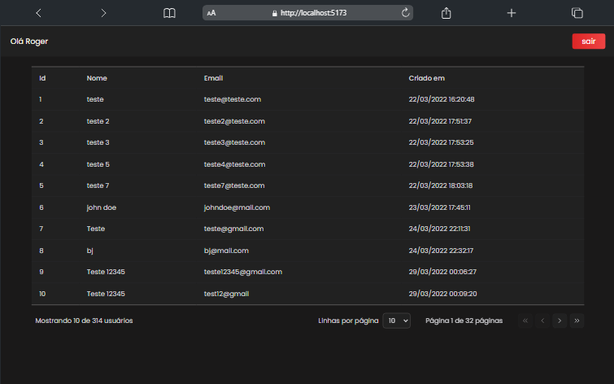
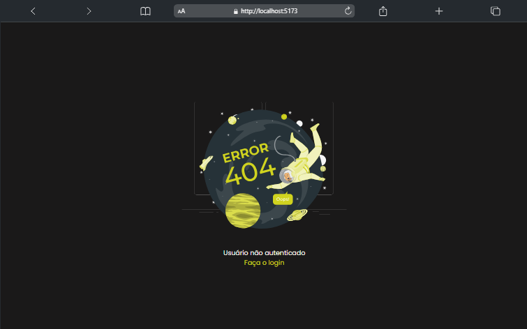

# 🔐 Auth Portal 


## 💻 Deploy

<a href="https://auth-portal-taupe.vercel.app/">Clique aqui para ver o projeto</a>


## 📝 Descrição

Este projeto consiste em um sistema de autenticação de usuários com três telas principais: Registro, Autenticação e Dashboard. O sistema se comunica com uma API para realizar as operações necessárias de registro, autenticação, exibição de usuários e logout.

## 🔧 Instalação

Instalação com npm

```bash
  git clone "https://github.com/rogervalentim/auth-portal"
  cd auth-portal
  npm install 
```

## 🔌 Como Rodar

```bash
  npm run dev
```

## 📊 Tecnologias e libs utilizadas 

<ul>
<li>React</li>
<li>React Query</li>
<li>Rect hook form</li>
<li>Zod</li>
<li>Tailwind css</li>
<li>Tailwind merge</li>
<li>Typescript</li>
<li>Sonner - toast</li>
<li>Lucide</li>
</ul>

## 📸 Imagens do Projeto

<p>Login - rota '/'</p>



<p>Signup - rota '/#/signup'</p>



<p>Dashboad - rota '/#/dashboard</p>



<p>Imagem de erro para usuários não autenticados</p>



